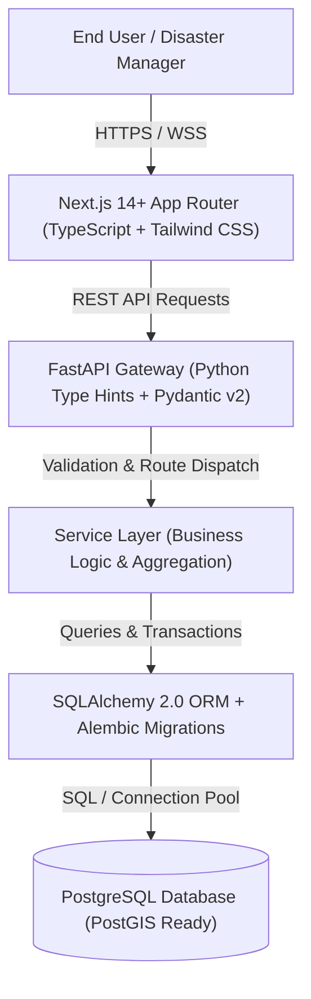
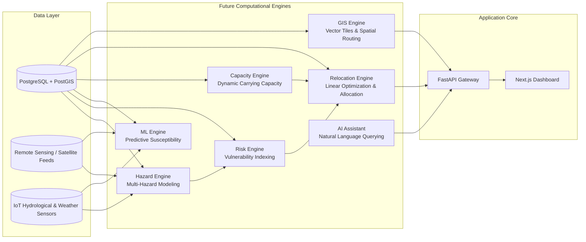

# HazardShield AI — System Architecture

## 1. Executive Summary
**HazardShield AI** (*Intelligent Identification of Hazard-Based Red Zones, Carrying Capacity Assessment, and Immediate Relocation Needs for Vulnerable Habitations*) is an enterprise-grade disaster-management decision-support platform designed to protect vulnerable habitations from natural hazards.

Milestone 1 establishes the technical foundation:
- **Clean Micro-Modular Architecture**: Decoupled Next.js frontend, FastAPI micro-service layer, and PostgreSQL relational core.
- **Relational Integrity**: 13 normalized entities covering habitations, vulnerability profiles, multi-hazard assessments, dynamic risk scoring, carrying capacities, safe haven shelters, and immediate relocation queues.
- **Strict Separation of Concerns**: Future AI/ML, advanced GIS, and optimization solvers plug directly into dedicated engine interfaces without altering core persistence.

---

## 2. Core Architectural Flow

---

## 3. High-Level Component Layers

### 3.1 Frontend Layer (`/frontend`)
- **Framework**: Next.js (React 18/19, App Router).
- **Styling**: Tailwind CSS with enterprise palette (Navy `#0f172a`, Slate `#1e293b`, Emerald `#10b981`, Amber `#f59e0b`, Orange `#f97316`, Rose `#ef4444`).
- **Icons**: Lucide React.
- **Shell**: Persistent application header with alert counters, side navigation, user status, and breadcrumbs.
- **Core Views**:
  - `/dashboard`: High-level command center with KPI metrics, risk distribution charts, vulnerability summaries, high-risk habitation tables, and interactive map placeholder.
  - `/habitations`: Habitations registry with multi-criteria filtering and detailed profile drilldowns.
  - `/risk-assessment`: Multi-hazard vulnerability matrix.
  - `/capacity`: Ecological & infrastructural carrying capacity stress tracker.
  - `/relocation`: Urgent relocation candidate queue and target shelter allocation.
  - `/safe-zones`: Verified safe havens and relief camps directory.
  - `/alerts`: Hazard notifications and evacuation bulletins.
  - `/reports`: Executive analytical briefs.
  - `/settings`: Platform configurations and role-based permissions matrix.
  - `/login`: Secure institutional authentication portal.

### 3.2 Backend Layer (`/backend`)
- **Framework**: FastAPI (Asynchronous Python 3.11+).
- **Data Validation**: Pydantic v2 schemas for request validation and serializable response models.
- **ORM & Migrations**: SQLAlchemy 2.0 declarative models and Alembic version-controlled schema migrations.
- **API Organization**:
  - `health`: Liveness & readiness probes including database ping.
  - `habitations`: Full CRUD-ready endpoints for habitation records.
  - `dashboard`: Real-time aggregated statistics for high-level decision makers.
  - `risk`: Composite risk scoring and hazard breakdowns.
  - `capacity`: Carrying capacity metrics and stress ratios.
  - `relocation`: Priority-ordered relocation recommendations.
  - `safe_zones`: Safe haven capacity and occupancy trackers.
  - `alerts`: Broadcast alerts and warning notices.

### 3.3 Database Layer (`/backend/app/models`)
The database schema consists of 13 primary relational tables:
1. `roles`: Role definitions (`ADMIN`, `AUTHORITY`, `ANALYST`, `VIEWER`).
2. `users`: System users with hashed credentials, roles, and status.
3. `habitations`: Geographic settlements with census, coordinates, and operational status.
4. `population_profiles`: Demographic vulnerability metrics (children, elderly, women, special care).
5. `infrastructure_profiles`: Utility and lifeline accessibility scores (roads, water, healthcare, shelter, power).
6. `hazard_assessments`: Individual hazard susceptibility values (flood, landslide, earthquake, cyclone, fire, heatwave).
7. `risk_scores`: Composite calculated scores and categorical levels (`SAFE_LOW`, `MODERATE`, `HIGH`, `CRITICAL`).
8. `capacity_assessments`: Carrying capacity limits, current demographic loads, and stress ratios.
9. `safe_zones`: Verified evacuation hubs, capacities, and elevation profiles.
10. `emergency_facilities`: Hospitals, relief shelters, fire stations, and emergency logistics nodes.
11. `relocation_recommendations`: Actionable relocation directives linked to safe zones with priority ratings.
12. `alerts`: Active emergency bulletins and warning dispatches.
13. `audit_logs`: Traceable system event ledger for regulatory compliance.

---

## 4. Future Engine Integration Plan (Milestones 2+)

HazardShield AI is engineered around modular service interfaces. The diagram below illustrates how specialized computation engines will connect to the platform:

### 4.1 Hazard Engine
- Ingests precipitation, slope elevation models (DEM), seismic fault proximities, and historical breach points.
- Produces normalized hazard susceptibility rasters.

### 4.2 Risk Engine
- Implements composite multi-criteria decision analysis (MCDA) combining hazard exposure, demographic vulnerability, and structural weakness.

### 4.3 Machine Learning Engine
- Employs gradient boosted trees (XGBoost/LightGBM) and spatial graph neural networks (GNN) to forecast slope stability and flash-flood inundation before severe weather peaks.

### 4.4 Carrying Capacity Engine
- Computes sustainable ecological and infrastructure thresholds for both threatened settlements and prospective safe zones.

### 4.5 Relocation & Evacuation Engine
- Solves multi-objective integer programming (MILP) optimization problems:
  - Minimizing travel distance and transit risk.
  - Ensuring receiving safe havens do not exceed maximum carrying capacity.
  - Preserving community cohesion during planned relocations.

### 4.6 GIS Spatial Engine
- Generates MVT (Mapbox Vector Tiles) and GeoJSON streams for high-performance client rendering (Leaflet/MapLibre).
- Executes network shortest-path algorithms (pgRouting) for emergency evacuation corridors.

### 4.7 AI Assistant
- Natural language decision-support chatbot providing quick situational summaries, query retrieval ("Show all habitations in Chamoli with landslide risk > 0.8"), and report generation for relief commissioners.

---

## 5. Security and Governance
- **Role-Based Access Control (RBAC)**: Distinct permissions for system administrators, district authorities, risk analysts, and field observers.
- **Audit Logging**: Every assessment update, alert dispatch, and relocation recommendation is captured in `audit_logs`.
- **Disclaimer Enforcement**: All simulated and demo data is clearly isolated and watermarked to prevent confusion with official government circulars.
